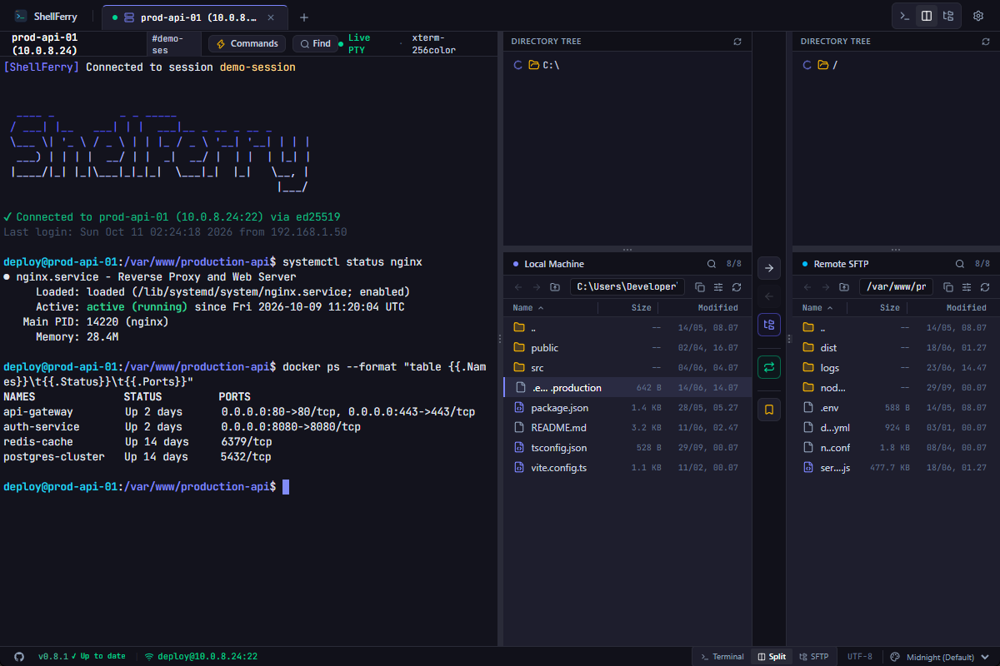

# ShellFerry

<p align="center">
  
</p>

<p align="center">
  <strong>Fast, lightweight SSH terminal and dual-pane SFTP client.</strong><br />
  Built on Tauri 2, Rust, React 19, and xterm.js. Native speed, zero Electron bloat.
</p>

<p align="center">
  <a href="https://github.com/rzkfyn/openterm/releases"></a>
  
  
  <a href="LICENSE"></a>
</p>

> *Formerly OpenTerm. Renamed in v0.8.0. Data migrates automatically.*

<p align="center">
  
</p>

---

## Downloads

Download installers from [Latest Release](https://github.com/rzkfyn/openterm/releases/latest):

| Platform | Format |
| --- | --- |
| **Windows** | `.msi` / `.exe` (x64, arm64) |
| **macOS** | `.dmg` (Apple Silicon, Intel) |
| **Linux** | `.deb` / `.AppImage` (x64) |

---

## Comparison

| Feature | ShellFerry | Termius | FileZilla | PuTTY |
| --- | :---: | :---: | :---: | :---: |
| **Terminal + SFTP Unified** | **Yes** | Yes | No (SFTP only) | No (SSH only) |
| **Memory Footprint** | **80–150 MB** | 400–800 MB | 100–200 MB | ~30 MB |
| **Runtime** | **Tauri 2 (Native Webview)** | Electron (Chromium) | C++ / wxWidgets | C / Win32 |
| **Biometric & 2FA Vault** | **Yes** | Paid plan | No | No |
| **License** | **Apache 2.0 (Open Source)** | Proprietary | Open Source | Open Source |

---

## Key Features

### ⚡ Performance & Core Engine
- **Lightweight (80–150 MB RAM)**: Tauri 2 uses native OS webviews instead of bundling Chromium.
- **Direct PTY Streaming**: Rust streams raw pseudo-terminal bytes straight to `xterm.js` via event emitters, avoiding IPC serialization overhead.
- **Zero-Binary JavaScript Rule**: SFTP file transfers run directly between SSH socket and local disk in native Rust (128 KB buffered stream). JS runtime never touches file binaries.
- **Virtualized File Explorer**: Smooth rendering for directories with thousands of files powered by `@tanstack/react-virtual`.

### 🖥️ Unified Terminal & File Sync
- **Bidirectional PTY ↔ SFTP Sync**: Terminal working directory and SFTP remote pane stay in sync automatically.
- **Multi-Session Tabs**: Connect, switch, and monitor multiple SSH hosts simultaneously.
- **Resilient Auto-Reconnect**: TCP keepalives (15s) and exponential backoff keep connections alive and restore buffers after dropouts.
- **Flexible Split Layouts**: Switch instantly between full terminal, full SFTP, or resizable dual split.

### 📁 SFTP File Management
- **Drag-and-Drop**: Transfer files between local/remote panes, target folders, or directly from OS file explorer.
- **In-App Code Editor**: Built-in editor with syntax highlighting for remote and local configuration files.
- **Transfer Conflict Resolution**: Side-by-side comparison with Overwrite, Overwrite Newer, Size Differs, Auto-Rename, and Skip actions.
- **Quick Search & Filter (`Ctrl+F`)**: Real-time multi-token search across current directory contents.
- **Visual Permissions (chmod)**: Inspect and adjust octal permissions (`0755`, `0644`) and flag bits visually.

### 🔒 Security & Vault
- **Encrypted Profile Vault**: Host credentials encrypted with PBKDF2-HMAC-SHA256 (100k rounds) + AES-256-GCM (`vault.enc`).
- **Biometrics & 2FA**: Native OS passkeys (Windows Hello fingerprint/face/PIN) and RFC 6238 TOTP authenticators.
- **Protection Gate**: Requires biometric or 2FA setup before saving credentials to disk.

---

## Keyboard Shortcuts

| Shortcut | Action | Shortcut | Action |
| --- | --- | --- | --- |
| `F5` / `Ctrl+R` | Refresh directory | `Ctrl+F` | Focus search & filter bar |
| `F2` | Rename item | `Ctrl+L` / `Alt+D` | Focus address bar |
| `Delete` | Delete item | `Enter` | Open folder / edit file |
| `Ctrl+N` | Create new file | `Backspace` / `Alt+Up` | Go to parent directory |
| `Ctrl+Shift+N` | Create new folder | | |

---

## Tech Stack

| Layer | Stack |
| --- | --- |
| **Desktop Engine** | [Tauri 2](https://v2.tauri.app/) |
| **Backend / Systems** | Rust, `ssh2-rs` (`libssh2`), `tokio`, `parking_lot` |
| **Frontend** | [React 19](https://react.dev/), TypeScript, [Tailwind CSS v4](https://tailwindcss.com/) |
| **Terminal** | [xterm.js](https://xtermjs.org/) + Fit & Web Links addons |
| **Virtualization** | [`@tanstack/react-virtual`](https://tanstack.com/virtual/latest) |
| **State & Icons** | [Zustand](https://github.com/pmndrs/zustand), [Lucide React](https://lucide.dev/) |

---

## Development & Build

### Prerequisites
- [Bun](https://bun.sh/) (or Node 20+)
- [Rust](https://rustup.rs/) (1.80+)
- C compiler & `pkg-config` / `libssl-dev` (Linux)

### Run Locally
```bash
git clone https://github.com/rzkfyn/openterm.git
cd openterm
bun install
bun run tauri dev
```

### Test & Package
```bash
bun test                    # Frontend unit tests
cd src-tauri && cargo test  # Rust backend tests
bun run tauri build         # Production executable
```

---

## Feedback & Issues

- **[Report Bug](https://github.com/rzkfyn/openterm/issues/new?template=bug_report.yml)**: Issue tracker for crashes or broken workflows.
- **[Request Feature](https://github.com/rzkfyn/openterm/issues/new?template=feature_request.yml)**: Suggestions and enhancements.
- **[Discussions](https://github.com/rzkfyn/openterm/discussions)**: General setup questions and community discussions.

> **Note**: Never post private keys, passwords, or server addresses in issue reports.

---

## License

Licensed under [Apache License 2.0](LICENSE). Copyright 2026 ShellFerry contributors.
